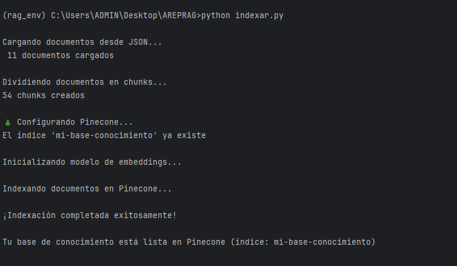
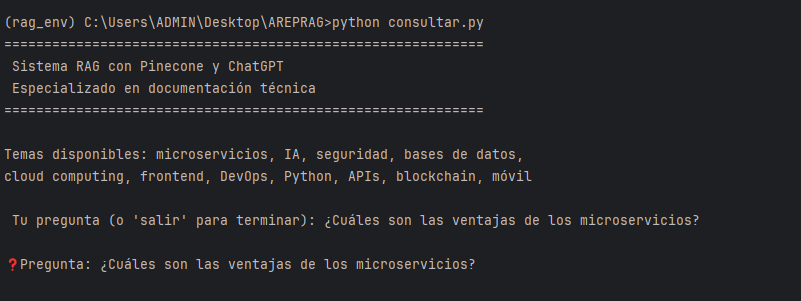
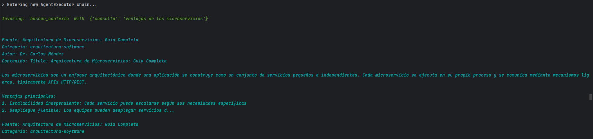
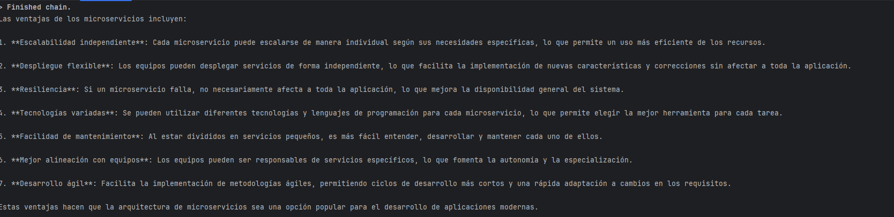
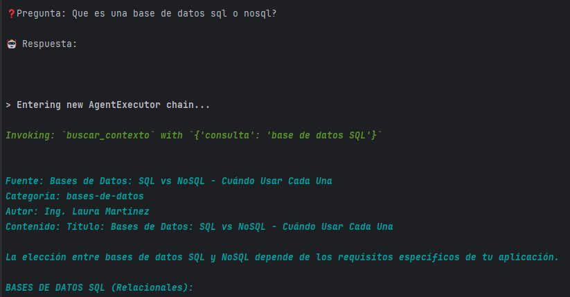
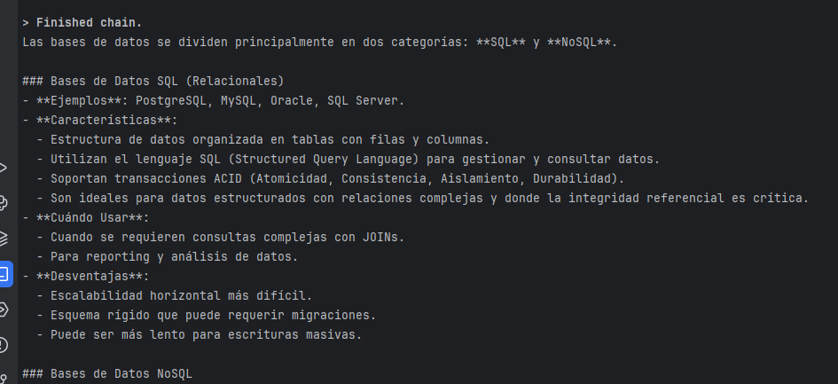
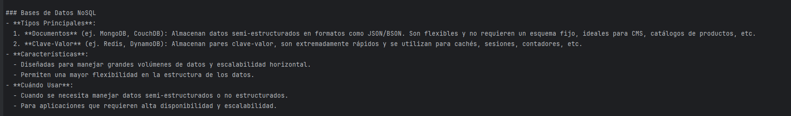

# Sistema RAG con Pinecone y ChatGPT

Sistema de Retrieval Augmented Generation (RAG) especializado en documentación técnica que permite realizar consultas inteligentes sobre temas de tecnología utilizando una base de conocimiento vectorial almacenada en Pinecone y modelos de lenguaje de OpenAI.


## Descripción del Proyecto

Este proyecto implementa un sistema RAG que combina:

- Base de Conocimiento Vectorial: Documentos técnicos indexados en Pinecone usando embeddings de OpenAI
- Agente Inteligente: Sistema de consulta basado en LangChain que utiliza herramientas para buscar información relevante
- Modelo de Lenguaje: GPT-4o-mini para generar respuestas contextualizadas basadas en la información recuperada

El sistema está especializado en temas como: microservicios, inteligencia artificial, seguridad informática, bases de datos, cloud computing, desarrollo frontend, DevOps, Python para data science, diseño de APIs, blockchain y desarrollo móvil.

## Caracteristicas

- El sistema está configurado para buscar los 3 documentos más relevantes (`k=3`) para cada consulta
- Los documentos se dividen en chunks de 1000 caracteres con un solapamiento de 200 caracteres
- El modelo de chat está configurado con `temperature=0` para respuestas más determinísticas
- El índice de Pinecone se crea automáticamente si no existe al ejecutar `indexar.py`


## Arquitectura y Componentes

#### 1. indexar.py - Sistema de Indexación

**Responsabilidades:**
- Carga documentos desde `data/documentos.json`
- Divide documentos en chunks usando `RecursiveCharacterTextSplitter`
- Crea o verifica el índice en Pinecone
- Genera embeddings usando OpenAI
- Almacena vectores en Pinecone

**Flujo de Proceso:**
```
JSON → Documentos → Chunks → Embeddings → Pinecone Vector Store
```

**Parámetros de Chunking:**
- `chunk_size`: 1000 caracteres
- `chunk_overlap`: 200 caracteres
- `add_start_index`: True

#### 2. consultar.py - Sistema de Consulta

Responsabilidades:
- Inicializa el agente con herramientas de búsqueda
- Procesa consultas del usuario
- Busca documentos relevantes en Pinecone
- Genera respuestas contextualizadas usando GPT-4o-mini

Componentes del Agente:
- Tool: `buscar_contexto()` - Realiza búsqueda semántica en Pinecone
- Prompt Template: Define el comportamiento del asistente
- Agent Executor: Orquesta la ejecución del agente

**Flujo de Consulta:**
```
Consulta → Agente → Tool (buscar_contexto) → Pinecone → 
Top 3 Documentos → Contexto → GPT-4o-mini → Respuesta
```

### Componentes de Infraestructura

#### Pinecone Vector Database
- Índice: `mi-base-conocimiento`
- Dimensiones: 1536 (text-embedding-3-small)
- Métrica: Cosine similarity
- Cloud: AWS (us-east-1)
- Especificación: Serverless

#### OpenAI Services
- Embeddings Model: `text-embedding-3-small`
- Chat Model: `gpt-4o-mini`
- Configuración:
  - Temperature: 0 (determinístico)
  - Request timeout: 30 segundos
  - Max retries: 2

#### LangChain Framework
- **Vector Store**: `PineconeVectorStore`
- **Text Splitter**: `RecursiveCharacterTextSplitter`
- **Agent**: `create_tool_calling_agent`
- **Prompt**: `ChatPromptTemplate`

##  Requisitos Previos

Antes de comenzar, asegúrate de tener instalado:

- Python 3.9 o superior
- Cuenta de OpenAI con API key
- Cuenta de Pinecone con API key

## Instalación

### Paso 1: Clonar o Descargar el Proyecto


```bash
git clone https://github.com/Daniel-Aldana10/AREP-RAG
cd AREP-RAG
```


### Paso 2: Crear un Entorno Virtual

Es recomendable usar un entorno virtual para aislar las dependencias del proyecto:

**En Windows (PowerShell):**
```powershell
python -m venv rag_env
```

**En Windows (CMD):**
```cmd
python -m venv rag_env
```

**En Linux/Mac:**
```bash
python3 -m venv rag_env
```

### Paso 3: Activar el Entorno Virtual

**En Windows (PowerShell):**
```powershell
.\rag_env\Scripts\Activate.ps1
```

**En Windows (CMD):**
```cmd
rag_env\Scripts\activate.bat
```

**En Linux/Mac:**
```bash
source rag_env/bin/activate
```

Después de activar el entorno virtual, deberías ver `(rag_env)` al inicio de tu línea de comandos.

### Paso 4: Instalar las Dependencias

Con el entorno virtual activado, instala todas las dependencias necesarias:

```bash
pip install --upgrade pip
pip install -r requirements.txt
```

Esto instalará las siguientes librerías:
- `langchain` - Framework para aplicaciones LLM
- `langchain-openai` - Integración con OpenAI
- `langchain-pinecone` - Integración con Pinecone
- `langchain-text-splitters` - División de texto
- `pinecone` - Cliente de Pinecone
- `python-dotenv` - Manejo de variables de entorno
- `openai` - SDK de OpenAI
- `tiktoken` - Tokenización para modelos OpenAI
- `pydantic` - Validación de datos
- `requests` - Cliente HTTP

### Paso 5: Verificar la Instalación

Verifica que todo se instaló correctamente:

```bash
python -c "import langchain; import pinecone; import openai; print('✓ Todas las dependencias están instaladas')"
```

## Configuración

### Paso 1:  Crear el Archivo .env

Crea un archivo llamado `.env` en la raíz del proyecto con el siguiente contenido:

```env
OPENAI_API_KEY=tu_openai_api_key_aqui
PINECONE_API_KEY=tu_pinecone_api_key_aqui
```
Y remplaza con las API KEYS correspondientes


## Uso

### Paso 1: Indexar los Documentos

Antes de poder hacer consultas, necesitas indexar los documentos en Pinecone:

```bash
python indexar.py
```

Este script:
1. Carga los documentos desde `data/documentos.json`
2. Los divide en chunks más pequeños
3. Crea el índice en Pinecone (si no existe)
4. Genera embeddings para cada chunk
5. Almacena los vectores en Pinecone

**Salida esperada:**
```
Cargando documentos desde JSON...
 10 documentos cargados

Dividiendo documentos en chunks...
150 chunks creados

 Configurando Pinecone...
El índice 'mi-base-conocimiento' ya existe
(o: Creando índice 'mi-base-conocimiento'...)

Inicializando modelo de embeddings...

Indexando documentos en Pinecone...

¡Indexación completada exitosamente!

Tu base de conocimiento está lista en Pinecone (índice: mi-base-conocimiento)
```


### Paso 2: Realizar Consultas

Una vez que los documentos están indexados, puedes iniciar el sistema de consultas:

```bash
python consultar.py
```

Esto iniciará un modo interactivo donde puedes hacer preguntas. El sistema mostrará:

```
============================================================
 Sistema RAG con Pinecone y ChatGPT
 Especializado en documentación técnica
============================================================

Temas disponibles: microservicios, IA, seguridad, bases de datos,
cloud computing, frontend, DevOps, Python, APIs, blockchain, móvil

 Tu pregunta (o 'salir' para terminar): 
```

**Ejemplos de consultas:**
- "¿Qué son los microservicios y cuáles son sus ventajas?"
- "Explícame las diferencias entre SQL y NoSQL"
- "¿Cuáles son las mejores prácticas de seguridad para APIs?"
- "Compara React, Vue y Angular"
- "¿Cómo funciona el sistema de consenso en blockchain?"

Para salir del sistema, escribe `salir`, `exit` o `quit`.

### Imagenes del funcionamiento 

## Indexar.py



## Consultar.py

Consulta ¿Cuáles son las ventajas de los microservicios?



Busqueda



Respuesta



Consulta y busqueda Que es una base de datos sql o nosql?



Respuesta





## Estructura del Proyecto

```
AREP-RAG/
│
├── consultar.py              # Script principal para consultas
├── indexar.py                # Script para indexar documentos
├── requirements.txt          # Dependencias del proyecto
├── README.md                 # Este archivo
├── .env                      # Variables de entorno (crear manualmente)
│
├── data/
│   └── documentos.json      # Documentos a indexar
```

### Descripción de Archivos

- **`consultar.py`**: Sistema de consulta interactivo que utiliza un agente de LangChain para responder preguntas basándose en la base de conocimiento vectorial.

- **`indexar.py`**: Script que procesa documentos JSON, los divide en chunks, genera embeddings y los almacena en Pinecone.

- **`requirements.txt`**: Lista de todas las dependencias de Python necesarias para el proyecto.

- **`data/documentos.json`**: Archivo JSON que contiene los documentos técnicos a indexar, cada uno con su contenido y metadata.

- **`.env`**: Archivo de configuración (no incluido en el repositorio) que contiene las API keys necesarias.

## Tecnologías Utilizadas

### Librerías Principales

- LangChain (`langchain`): Framework para construir aplicaciones con modelos de lenguaje
- OpenAI (`openai`, `langchain-openai`): Modelos de embeddings y chat (GPT-4o-mini, text-embedding-3-small)
- Pinecone (`pinecone`, `langchain-pinecone`): Base de datos vectorial para almacenamiento y búsqueda semántica
- Python-dotenv (`python-dotenv`): Gestión de variables de entorno

